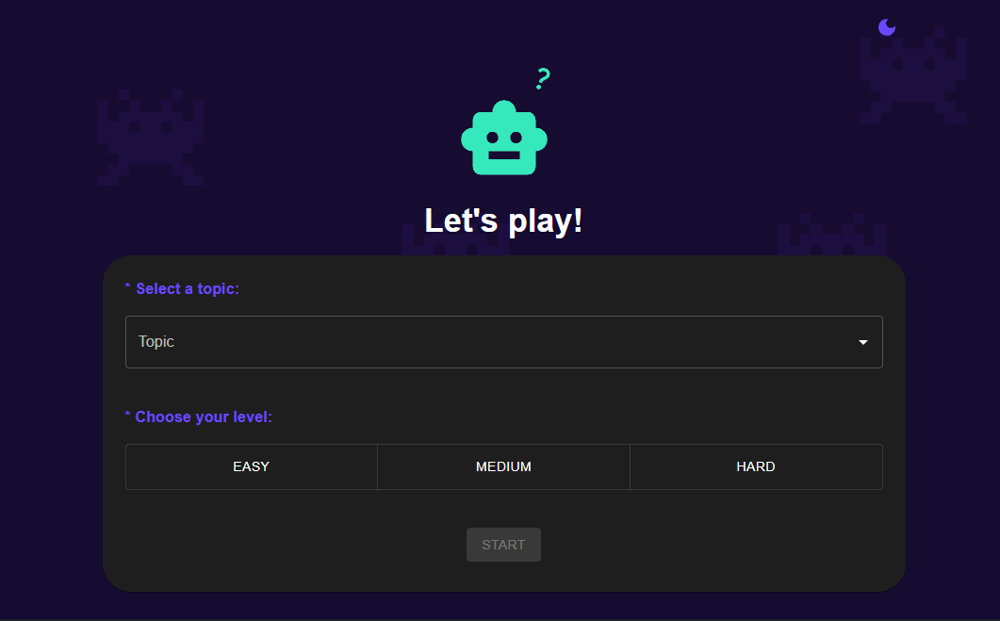
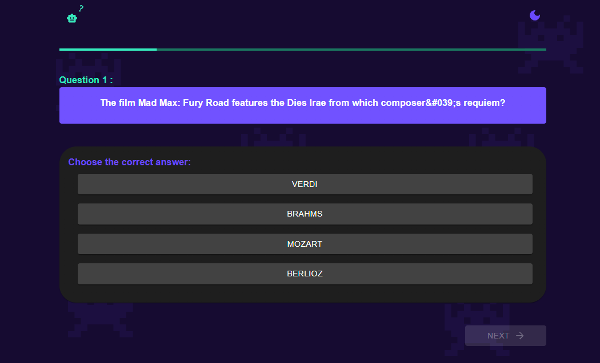
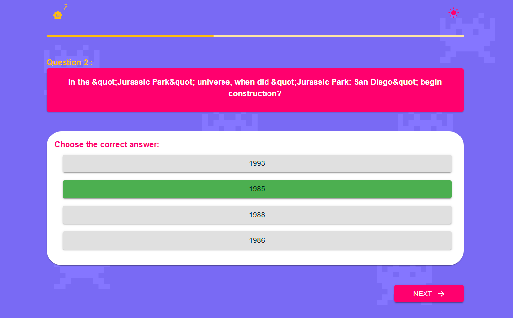
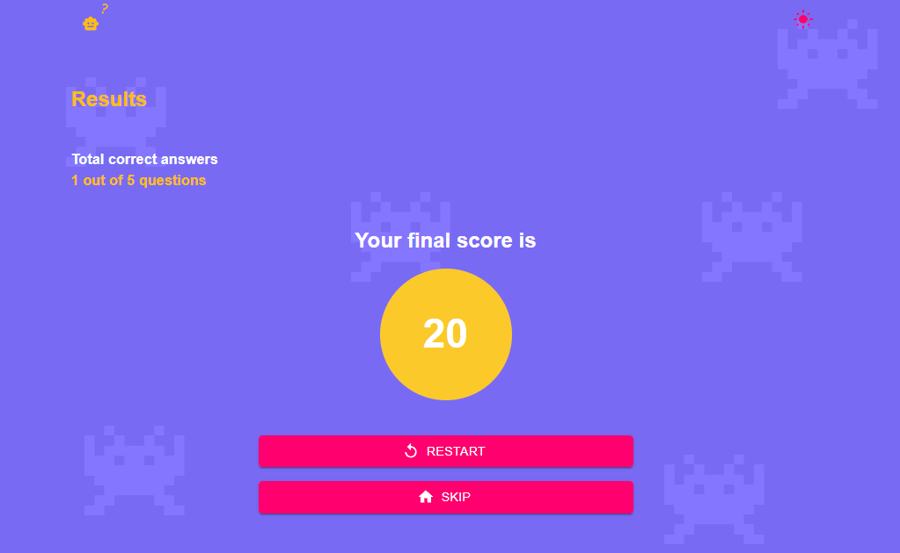

# Quizz App - Possumus Challenge

¡Bienvenido a **Quizz App**! 🧠🎉 Un juego interactivo donde puedes desafiar tus conocimientos en distintas categorías.

## 🚀 Tecnologías Utilizadas

- ⚛️ **React 19**
- 🎨 **MUI (Material UI) + Emotion**
- 🔥 **Redux Toolkit + React Redux** (manejo de estado global)
- 🌐 **Axios** (para consumo de API)
- 🧪 **ESLint + Prettier** (estandarización de código)
- 🛠 **TypeScript** (tipado estático)

## 📸 Capturas de Pantalla









## 📌 Características

✅ Selección de temática y dificultad  
✅ Trivia de 5 preguntas con respuestas de múltiple opción  
✅ Interfaz amigable e intuitiva con Material UI disponible en modo oscuro y claro
✅ Sistema de puntaje basado en respuestas correctas  
✅ Botón para reiniciar la partida o configurar una nueva

## 🔧 Instalación y Ejecución

1️⃣ Clona este repositorio:

```bash
git clone https://github.com/pao95/possumus-challenge
cd possumus-challenge
```

2️⃣ Instala las dependencias:

```bash
npm install
```

3️⃣ Inicia el servidor de desarrollo:

```bash
npm run dev
```

4️⃣ Abre en tu navegador:

```
http://localhost:5173
```
